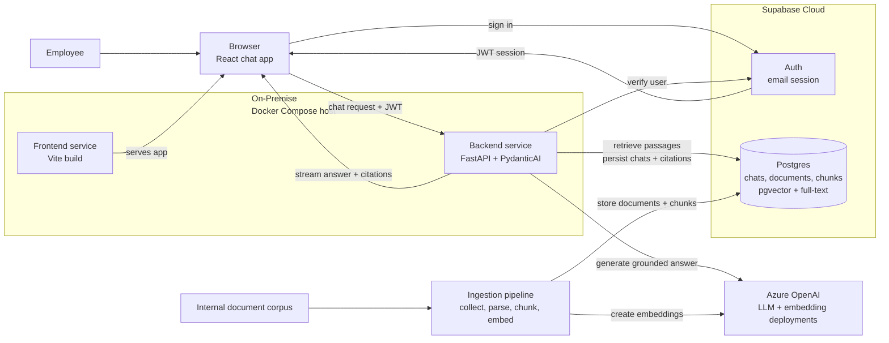

# Document Copilot Architecture

## Purpose

Document Copilot is an internal knowledge assistant for employees who need grounded answers from the company's policies, guidelines, and technical work instructions. The architecture must optimize for trust: every answer is generated from retrieved source passages, every factual claim is citable, and the system fails clearly when the corpus does not support an answer.

This document describes the target architecture for the chat experience, LLM orchestration, and the communication layer between the React SPA, Supabase, and FastAPI backend.

## High-Level Architecture

The best opening diagram is a service-level view that shows the two core paths: the live chat path that serves users, and the ingestion path that prepares internal documents for retrieval.



## Architectural Goals

- Keep the browser thin: it renders chat state, manages the user's Supabase session, and streams assistant responses.
- Keep the backend authoritative: retrieval, grounding, citation checks, tool execution, and database writes happen in FastAPI.
- Use Supabase for identity and durable product state: users, chat threads, source documents, chunks, embeddings, and citation metadata.
- Use Supabase `pgvector` for semantic retrieval and Postgres full-text search for keyword retrieval.
- Make the LLM path typed and testable by using PydanticAI agents with explicit dependencies, outputs, and tool boundaries.
- Preserve a simple deployment model on-premise: one frontend container, one stateless backend container behind a company-managed reverse proxy, running on internal infrastructure via Docker Compose, with Supabase remaining a hosted cloud service for auth and durable state.

## Stack

Frontend:

- Vite + React SPA + TypeScript
- React Router for routing
- Tailwind CSS and shadcn/ui for UI
- `@supabase/supabase-js` for browser auth
- Vercel AI SDK UI packages for chat state and streaming client behavior

Backend:

- Python 3.12+
- FastAPI + Uvicorn
- Pydantic v2 + pydantic-settings
- PydanticAI for typed LLM orchestration
- OpenAI SDK configured for Azure OpenAI (`AzureOpenAI` client) for generation and embeddings
- Supabase Python client for server-side database access
- SQLAlchemy models + Alembic migrations for schema management
- Supabase `pgvector` for semantic search
- Postgres full-text search for lexical retrieval
- `httpx` for outbound HTTP
- `structlog` for structured logs

Persistence:

- Supabase Auth for email login
- Supabase Postgres for user records, chat threads, chat messages, source documents, chunks, embeddings, full-text search vectors, and citation metadata

## System Boundaries

The frontend is responsible for user interaction, local UI state, and sending the authenticated user's request to the backend. It should never hold service-role credentials, run retrieval logic, call Azure OpenAI directly, or write privileged records to Supabase.

The backend is responsible for request authorization, retrieval, prompt construction, LLM execution, citation validation, streaming responses, and durable persistence. It owns all privileged credentials and is the only service allowed to use the Supabase service-role key.

Supabase is responsible for authentication and durable product state. Browser access uses the anon key and user JWT. Server access uses either the user's bearer token for user-scoped operations or the service-role key for privileged writes that must still be explicitly tied to the authenticated user.

## Request Flow

1. The user signs in with Supabase email auth in the React SPA.
2. The frontend stores the Supabase session through `@supabase/supabase-js`.
3. When the user opens a chat, the frontend loads the thread and prior messages through FastAPI, which reads user-scoped records from Supabase.
4. The chat UI uses the Vercel AI SDK React primitives to manage message state and submit new user messages to the FastAPI chat endpoint.
5. The frontend sends the Supabase access token as `Authorization: Bearer <token>`.
6. FastAPI verifies the token with Supabase Auth before doing any retrieval or LLM work.
7. FastAPI creates a request-scoped context containing the authenticated user, chat thread, Supabase client, retrieval service, citation policy, and LLM settings.
8. A PydanticAI agent retrieves relevant document chunks, generates a grounded answer, and returns typed output containing answer text and citations.
9. FastAPI streams assistant message parts back to the browser in the format expected by the AI SDK client.
10. FastAPI persists the final user message, assistant message, cited chunks, and usage metadata to Supabase.

## Frontend Chat Layer

The frontend remains a plain Vite SPA. It should not adopt Next.js route handlers or server components. The AI SDK is used only for its React chat primitives and streaming client behavior.

The chat module should be organized around these responsibilities:

- `src/lib/env.ts` validates `VITE_API_BASE_URL`, `VITE_SUPABASE_URL`, and `VITE_SUPABASE_ANON_KEY`.
- `src/lib/supabase.ts` creates the browser Supabase client.
- `src/lib/http.ts` wraps `fetch`, applies the backend base URL, injects the Supabase bearer token, handles timeouts, and converts failures into typed API errors.
- `src/lib/api.ts` exposes product-level calls such as loading threads, creating threads, and fetching message history.
- `src/pages/chat/*` renders chat routes and delegates chat streaming to a focused chat component.
- `src/components/chat/*` renders messages, citations, source passages, empty states, and streaming status.

The chat component should initialize with stored messages and then let the AI SDK manage in-flight UI state. The transport points to FastAPI, not to a frontend server route.

Conceptual shape:

```ts
const { messages, sendMessage, status, error } = useChat({
  id: threadId,
  messages: initialMessages,
  transport: new DefaultChatTransport({
    api: `${apiBaseUrl}/chat/stream`,
    headers: async () => ({
      Authorization: `Bearer ${await getAccessToken()}`,
    }),
  }),
});
```

The exact API surface should be verified during implementation against the installed AI SDK version. The architectural rule is stable: the browser streams to FastAPI with the user's Supabase token, and FastAPI owns the assistant run.

## Backend LLM Layer

PydanticAI should be introduced as the backend's orchestration layer for answer generation. It replaces ad hoc prompt calls with a typed agent boundary.

Recommended backend modules:

```text
backend/app/
├── api/
│   └── chat.py                 # FastAPI routes for chat threads and streaming
├── auth/
│   └── dependencies.py         # Supabase JWT verification and current user dependency
├── chat/
│   ├── orchestrator.py         # Coordinates one chat turn end-to-end
│   ├── messages.py             # Converts AI SDK messages to and from internal message types
│   └── streaming.py            # Emits AI SDK-compatible streaming events
├── assistant/
│   ├── agent.py                # PydanticAI agent definition
│   ├── deps.py                 # Runtime dependency dataclass for the agent
│   ├── outputs.py              # GroundedAnswer, Citation, and SourcePassage
│   └── instructions.md         # System instructions and product contract
├── retrieval/
│   ├── queries.py              # pgvector and full-text SQL queries
│   ├── fusion.py               # Reciprocal Rank Fusion for hybrid search
│   └── retriever.py            # Query-to-source-passage retrieval logic
├── grounding/
│   └── validator.py            # Ensures citations map to retrieved passages
└── database/
    ├── supabase.py             # Supabase client construction
    ├── models.py               # SQLAlchemy table models used by Alembic autogenerate
    ├── chats.py                # Chat, thread, message, and citation persistence
    └── documents.py            # Source document, chunk, embedding, and search queries
```

These names should follow the product workflow rather than a generic service layer. `chat/orchestrator.py` owns the full turn lifecycle, `assistant/agent.py` owns the LLM boundary, `retrieval/` owns hybrid source-passage search, and `grounding/` owns the trust contract that answers must cite retrieved evidence.

The agent should receive explicit dependencies rather than reaching into globals:

```python
@dataclass
class DocumentAgentDeps:
    user_id: str
    thread_id: str
    retriever: DocumentRetriever
    grounding_validator: GroundingValidator


class GroundedAnswer(BaseModel):
    answer: str
    citations: list[Citation]
    cited_passages: list[SourcePassage]
```

The agent's instructions should encode the product contract:

- Answer only from retrieved passages.
- Cite every factual claim.
- If the retrieved context is insufficient, say that the corpus does not contain enough evidence.
- Do not provide binding interpretation beyond what the cited text says; for ambiguous or high-stakes questions, tell the user to confirm with the document owner or the relevant department (HR, Legal, etc.).
- Keep answers concise enough for quick review, but include enough cited passages to verify the answer.

Retrieval and grounding remain independent from PydanticAI. This keeps ingestion, retrieval tests, and citation validation testable without invoking the LLM.

## Retrieval Strategy

Document Copilot uses hybrid retrieval:

1. Embed the user's query with the configured Azure OpenAI embedding deployment.
2. Run a semantic search over `document_chunks.embedding` with `pgvector`.
3. Run a lexical search over `document_chunks.search_vector` with Postgres full-text search.
4. Fuse the two ranked lists in Python with Reciprocal Rank Fusion.
5. Fetch the selected chunks, source document metadata, and optional neighboring chunks for grounding.

This keeps the database responsible for efficient ranked retrieval and keeps the application responsible for product-specific ranking policy. The first implementation should avoid agent-generated SQL; the PydanticAI agent receives bounded tools such as `search_documents`, `read_chunk`, and `read_surrounding_chunks`.

## Supabase and FastAPI Communication

Supabase Auth is the identity source. FastAPI must treat the browser's Supabase JWT as the request credential.

Frontend rules:

- Use the anon key only in the browser.
- Read the current session through the shared Supabase client.
- Send the access token to FastAPI through the shared API client.
- Never pass tokens through component props.
- Never expose the service-role key to the frontend.

Backend rules:

- Verify `Authorization: Bearer <token>` at the FastAPI boundary.
- Reject unauthenticated requests before retrieval or LLM work.
- Derive `user_id` and email from the verified Supabase user.
- Use user-scoped database operations wherever possible.
- Use the service-role key only on the backend for privileged writes that cannot be safely performed with the anon key.
- Always attach persisted chat records to the authenticated `user_id`.

The backend can verify the JWT by calling Supabase Auth's user endpoint or by validating the project's JWT signing keys. For the first implementation, calling Supabase Auth is simpler and avoids local JWT validation mistakes. If request volume grows, local JWT verification can be added behind the same `AuthService` interface.

Recommended backend units:

- `app/auth/dependencies.py` validates bearer tokens and exposes `get_current_user`.
- `app/database/supabase.py` creates user-scoped and admin Supabase clients.
- `app/database/chats.py` stores and reads chat threads, messages, and citation records.
- `app/database/documents.py` stores and reads source documents, chunks, embeddings, and full-text search data.

## Streaming Contract

The frontend should receive incremental assistant output, not wait for a full answer. FastAPI should expose a streaming endpoint that emits AI SDK-compatible message parts.

Recommended endpoint:

```text
POST /chat/stream
Authorization: Bearer <supabase_access_token>
Content-Type: application/json
```

Request body:

```json
{
  "threadId": "uuid",
  "messages": []
}
```

The `messages` payload should use the AI SDK UI message format at the frontend boundary. FastAPI can translate that wire format into internal Pydantic models before invoking the agent.

Streaming responsibilities:

- Send text deltas as the answer is generated.
- Send citation/source metadata as structured parts once available.
- Send clear error events for authentication failures, missing threads, retrieval failures, and grounding failures.
- Persist only after the assistant run completes successfully, unless a separate partial-message model is deliberately introduced later.

## Data Model

Supabase tables should be small and product-oriented:

- `users`: one row per authenticated user, keyed by Supabase `auth.users.id`.
- `chat_threads`: thread metadata, owner, title, timestamps.
- `chat_messages`: user and assistant messages in order, with AI SDK-compatible message JSON where useful.
- `message_citations`: normalized citation records linked to assistant messages.
- `source_documents`: original document records with policy/guideline metadata, source location, and normalized Markdown content.
- `document_chunks`: chunk text, chunk metadata, embeddings, and generated full-text search vectors.

`source_documents` stores the normalized Markdown version of each document (converted from its PDF/DOCX/PPT source file) so the application can re-chunk, inspect, and cite the original extracted text without reaching back into the source file. Each row also tracks `document_type` (policy, guideline, work instruction), `department`, `owner`, `version`, `effective_date`, and `status` (`current` or `superseded`). When a document is revised, the new version is inserted as a new row and the prior row is marked `superseded` with a `superseded_by` reference, so retrieval never grounds an answer in an outdated version.

`document_chunks` stores retrieval-ready passages:

- chunk ID
- document ID
- chunk index
- heading path (section and subsection titles) so a chunk keeps its place in the document's structure
- chunk text
- embedding vector
- generated `tsvector` for full-text search
- token count
- metadata JSON for department, document type, version, and source offsets

Hybrid retrieval runs two bounded queries against `document_chunks`, scoped to `status = current`: a semantic `pgvector` query and a Postgres full-text query. The backend fuses those ranked lists with Reciprocal Rank Fusion, then fetches the selected chunks and neighboring context for grounding.

## Schema Management

Database schema changes are managed from the backend with SQLAlchemy models and Alembic migrations. Supabase is the hosted Postgres database, but the Supabase dashboard is not the source of truth for table definitions.

The workflow is:

1. Update SQLAlchemy models in `app/database/models.py`.
2. Generate a candidate migration with `uv run alembic revision --autogenerate -m "<change>"`.
3. Review the generated migration file in `backend/alembic/versions/`.
4. Add explicit migration operations for Postgres/Supabase features that autogenerate cannot infer reliably.
5. Apply the migration locally or against the linked Supabase database with `uv run alembic upgrade head`.
6. Commit both the model changes and the migration file.

Normal tables and ordinary indexes should be represented in SQLAlchemy models where practical. The following should be written explicitly in migrations with `op.execute()` or carefully reviewed Alembic operations:

- `create extension if not exists vector`
- `vector(1536)` embedding columns if the SQLAlchemy type renderer is not sufficient
- generated `tsvector` columns
- HNSW indexes for vector search
- GIN indexes for full-text search and JSON metadata
- RLS enablement and policies
- grants or Supabase role-specific permissions

Alembic must connect with Supabase's direct/session database connection string. Do not run migrations through the transaction pooler URL, because schema migrations, extension setup, and index creation require session-level database behavior.

## Grounding and Citation Policy

Grounding is part of the architecture, not a prompt preference.

The backend should enforce these invariants:

- Every assistant answer has at least one citation unless the answer explicitly says there is not enough evidence.
- Every citation maps to a retrieved source passage.
- Cited passages include enough metadata for the frontend to show company, filing, date, page or section, and excerpt.
- The model cannot cite documents that were not retrieved for the current request.
- If citation validation fails, the backend returns a controlled failure instead of a polished unsupported answer.

This policy should be covered by backend unit tests around retrieval, citation extraction, and grounding enforcement.

## Error Handling

Expected error classes:

- `401 Unauthorized`: missing, expired, or invalid Supabase token.
- `403 Forbidden`: authenticated user tries to access another user's thread.
- `404 Not Found`: thread or source document does not exist.
- `422 Unprocessable Entity`: invalid request payload.
- `502 Bad Gateway`: upstream LLM or Supabase failure.
- `500 Internal Server Error`: unexpected backend failure.

The frontend should render friendly messages while preserving enough technical detail in logs for debugging. Network and CORS failures should be distinguishable from HTTP failures in the shared API client.

## Configuration

Each service must keep one settings module as the source of truth.

Frontend settings:

- `VITE_API_BASE_URL`
- `VITE_SUPABASE_URL`
- `VITE_SUPABASE_ANON_KEY`

Backend settings:

- `SUPABASE_URL`
- `SUPABASE_ANON_KEY`
- `SUPABASE_SERVICE_ROLE_KEY`
- `DATABASE_URL` for Alembic and direct Postgres access
- `AZURE_OPENAI_ENDPOINT`
- `AZURE_OPENAI_API_KEY`
- `AZURE_OPENAI_API_VERSION`
- `AZURE_OPENAI_CHAT_DEPLOYMENT`
- `AZURE_OPENAI_EMBEDDING_DEPLOYMENT`
- `ALLOWED_ORIGINS`
- embedding dimensions (must match the embedding deployment's model)

Do not read environment variables directly from components, route handlers, or services. Frontend code should use `src/lib/env.ts`. Backend code should use `app/config.py`.

## Deployment Shape

The app runs on-premise via Docker Compose on a company-managed server:

- Frontend container: static Vite build served by a lightweight web server.
- Backend container: FastAPI service running Uvicorn.
- A reverse proxy (e.g. Nginx or Caddy) in front of both containers terminates TLS and routes `/` to the frontend and `/api` (or a dedicated subdomain) to the backend.

Both containers need outbound HTTPS access to two external endpoints: Supabase Cloud (auth + Postgres) and the Azure OpenAI endpoint. No inbound access from either external service is required, so the host can sit behind the company firewall with only the reverse proxy's port exposed to employees.

Supabase remains hosted and stores the durable retrieval data. The backend can stay stateless because document chunks, embeddings, full-text search vectors, chats, and citations all live in Supabase Postgres — this means container restarts, redeploys, or moving to a different on-prem host do not risk data loss. Raw source files (PDF/DOCX/PPT) remain gitignored local ingestion inputs unless a later workflow stores them in object storage.

Because the frontend and backend are stateless containers, the compose file, environment configuration, and reverse-proxy config should be treated as the deployment's source of truth and kept in version control (secrets excluded).

## Implementation Sequence

1. Scaffold the frontend SPA and backend FastAPI app according to the repo conventions.
2. Add SQLAlchemy models and Alembic migration setup in the backend.
3. Add the initial Alembic migration for `pgvector`, source document, chunk, full-text, chat, and citation tables.
4. Add Supabase Auth in the frontend and token verification in FastAPI.
5. Add the shared frontend API client with automatic bearer-token injection.
6. Add the chat streaming endpoint with a stubbed assistant response.
7. Add AI SDK chat UI on the frontend pointed at FastAPI.
8. Add document ingestion (PDF/DOCX/PPT to Markdown), chunking, embeddings, and Supabase writes.
9. Add semantic search with `pgvector`.
10. Add Postgres full-text search and Python RRF fusion.
11. Add PydanticAI document agent with typed dependencies and typed answer output.
12. Add citation validation and grounding enforcement.
13. Add final UI for citations, source passages, empty states, and errors.

## Non-Goals

- No Next.js, SSR, server components, or frontend route handlers.
- No direct Azure OpenAI calls from the browser.
- No separate managed vector database outside Supabase.
- No per-document or per-department access control in v1: every authenticated employee can retrieve every current document. This keeps the first version simple; see Future Considerations for how to add it later without a rearchitecture.
- No external market/news data.
- No binding policy interpretation or legal/HR advice beyond citing the source text.

## Future Considerations

- **Per-document access control.** If some documents end up restricted (e.g. HR-only, department-only), add a `visibility` or `allowed_roles` column to `source_documents` and filter the retrieval query by the requesting user's role/department. This is additive: it constrains which documents are searched, and does not change the retrieval, grounding, or streaming architecture.
- **Document sensitivity classification.** If restricted documents are introduced, pair access control with a sensitivity label so the frontend can flag restricted sources in the UI.
- **Chunking tuning.** Start with heading-aware chunking (already reflected in the data model); revisit chunk boundaries once real work-instruction documents show how deeply nested their procedures are.
